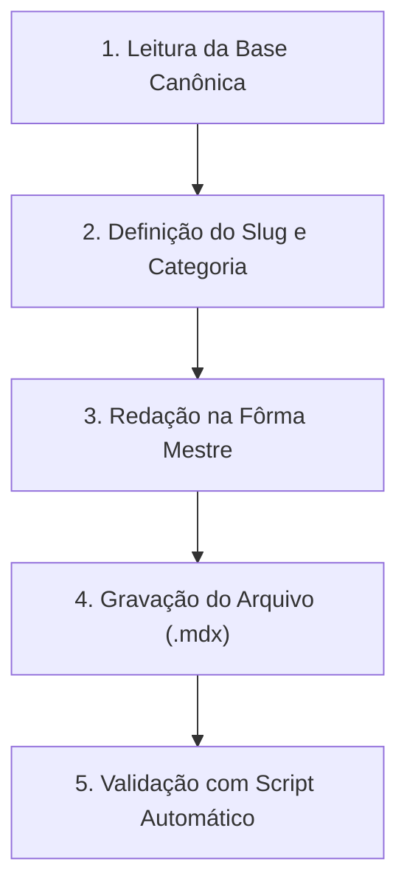

# Skill: Criador de Artigos de Blog (Brincar Educando)

Esta skill orienta o agente na geração e manutenção de artigos curados no diretório `content/blog/*.mdx`, garantindo **zero erros técnicos de renderização**, **alinhamento rigoroso à base científica canônica** e **blindagem total contra alucinações**.

---

## 🧭 Fluxo de Execução Obrigatório (Passo a Passo)



---

### Passo 1: Consulta à Base Canônica (Anti-Alucinação)
Antes de redigir qualquer linha, o agente DEVE consultar as referências do projeto:
1. **Evidências Científicas**: Inspecione [`docs/ciencia/MATRIZ_DE_EVIDENCIAS.md`](file:///c:/Users/emanu/Documents/Projetos/Brincar%20Educando/brincar-educando-2/app/docs/ciencia/MATRIZ_DE_EVIDENCIAS.md) para apoiar os conceitos do artigo em dados reais da OMS, AAP, SBP ou UNICEF.
2. **Termos Proibidos**: Consulte [`references/forbidden-terms.md`](./references/forbidden-terms.md) para garantir que nenhuma alegação indevida (ex: "superbebê", "acelera o cérebro", "previne atrasos", "gênio", "preguiçoso") seja utilizada.
3. **Categorias Permitidas**: Consulte [`references/category-matrix.md`](./references/category-matrix.md) e selecione exatamente uma categoria oficial.

---

### Passo 2: Metadados e Definição do Slug
Defina o frontmatter YAML respeitando o seguinte esquema:

```yaml
---
title: "Título Empático, Acolhedor e Focado na Necessidade Real da Família"
slug: "kebab-case-sem-acentos-identico-ao-nome-do-arquivo"
date: YYYY-MM-DD
excerpt: "Resumo cativante em 1 ou 2 frases explicando o que os pais vão descobrir com respeito e base científica, sem culpas."
category: "Desenvolvimento" # Deve ser uma das categorias oficiais
readTime: "6 min"
thumbnail: "/images/kebab-case-do-slug.png"
---
```

*Regras dos Metadados:*
- O `slug` deve coincidir exatamente com o nome do arquivo (ex: `slug: sono-do-bebe` -> `content/blog/sono-do-bebe.mdx`).
- A `category` deve coincidir exatamente com uma das 8 opções oficiais (com letras maiúsculas e acentos corretos).

---

### Passo 3: Redação do Artigo na "Fôrma Mestre"
O conteúdo deve seguir rigorosamente o template [references/post-blueprint.mdx](./references/post-blueprint.mdx).

#### A. Imports Obrigatórios no topo do arquivo (após o frontmatter):
```mdx
import { Info, Tip, Warning, Callout, Checklist } from "@/components/ui/blocks"
import { Image } from "@/components/ui/image"
import ProductEmbed from "@/components/ProductEmbed"
```

#### B. Esqueleto de Seções Obrigatórias:
1. **Abertura Afetiva**: Validação das emoções e desafios dos cuidadores (1º parágrafo).
2. **<Image>**: Imagem gerada no formato 16:9 posicionada imediatamente após o 1º parágrafo (`<Image src="/images/<slug>.png" alt="..." />`) para trazer leveza visual e conforto imediato ao leitor.
3. **<Callout>**: Tese central ou frase inspiradora do artigo.
4. **## O que a ciência nos mostra**: Fundamentação leve com bloco `<Info>` (citando conceitos da matriz de evidências).
5. **## O que é esperado para cada fase**: Linha do tempo ou marcos de prontidão sem rotular a criança.
6. **## Como agir na prática: Passo a passo**:
   - Etapas numeradas e claras.
   - **### Scripts de fala para o dia a dia**: Frases prontas em itálico entre aspas (*"Eu te escuto..."*).
   - Bloco `<Tip>` com "Guia de Bolso".
7. **## O que evitar e por quê**: Práticas ultrapassadas e alternativas gentis dentro do bloco `<Warning>`.
8. **## Prevenção e rotina no dia a dia**: Organização de ambiente com o componente `<Checklist items={[...]} />`.
9. **## Quando buscar ajuda profissional?**: Sinais de alerta objetivos com encaminhamento ético a pediatras/especialistas.
10. **## Mitos e verdades**: Formato de pares `Mito:` / `Verdade:`.
11. **## Conclusão e afeto**: Mensagem encorajadora com CTAs (salvar, compartilhar, comentar).

#### C. Regra Crítica de Títulos (ToC & SEO):
- **NUNCA USE `# H1` NO CORPO DO MDX**. A página [app/(blog)/blog/[slug]/page.tsx](file:///c:/Users/emanu/Documents/Projetos/Brincar%20Educando/brincar-educando-2/app/app/(blog)/blog/[slug]/page.tsx) já renderiza o `<h1>` principal usando o `title` do frontmatter.
- Todos os títulos de seção devem começar a partir de `## H2` e subtítulos com `### H3` para que o [TableOfContents.tsx](file:///c:/Users/emanu/Documents/Projetos/Brincar%20Educando/brincar-educando-2/app/components/blog/TableOfContents.tsx) funcione perfeitamente.

---

### Passo 4: Geração da Imagem do Artigo
Sempre que gerar um novo post, o agente deve criar a imagem conceitual que ilustra a capa e o corpo:
1. Consulte [`references/image-prompting-guide.md`](./references/image-prompting-guide.md) para montar o prompt no estilo editorial acolhedor da marca (*soft pastel colors, cozy warm illustration, modern parenting aesthetic*).
2. Utilize a ferramenta `generate_image` com:
   - `Prompt`: Descrição da cena afetiva alinhada ao tema.
   - `ImageName`: O mesmo identificador do `<slug>`.
   - `AspectRatio`: `"16:9"`.
3. Garanta que a imagem seja salva em `public/images/<slug>.png` para que o Next.js e o MDX a renderizem automaticamente tanto na Thumbnail do card quanto no componente `<Image>`.

---

### Passo 5: Gravação do Arquivo MDX
Grave o arquivo em `content/blog/<slug>.mdx`.

---

### Passo 6: Validação Automatizada (Obrigatória)
Após criar ou editar o arquivo, execute o validador via terminal:

```bash
node .agents/skills/blog-post-creator/scripts/validate-blog-post.mjs content/blog/<slug>.mdx
```

- Se o script retornar `❌ FALHA NA VALIDAÇÃO`, corrija imediatamente as inconsistências apontadas antes de dar a tarefa como concluída.
- O post só é considerado aprovado quando o validador exibir `✅ POST VALIDADO COM SUCESSO!`.
