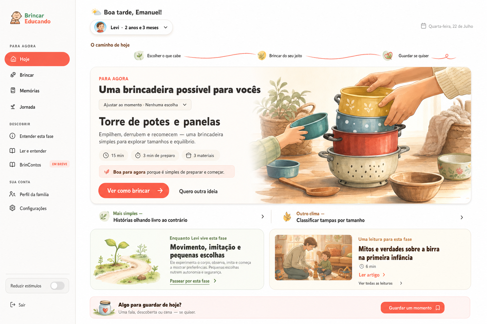

# Plano Definitivo de Implementação — Dashboard “Hoje”

> Especificação executiva do redesign aprovado para a página autenticada `/dashboard` do Brincar Educando.

**Status:** 🟡 implementado; aguardando conferência total e validação autenticada das páginas internas  
**Data da decisão:** 22 de julho de 2026  
**Referência visual aprovada:** [mockup do Dashboard Hoje](assets/dashboard-hoje-redesign-reference.png)  
**Documento relacionado:** [Plano Mestre da Nova UX](../PLANO_MESTRE_NOVA_UX.md)

Este documento transforma o mockup aprovado em um plano de implementação completo. Em caso de conflito estritamente visual ou estrutural sobre o dashboard, esta especificação substitui as decisões anteriores das seções de dashboard do Plano Mestre. Os princípios de segurança, linguagem, acessibilidade, privacidade e não avaliação da criança permanecem inalterados.

---

## 1. Resultado a entregar

O Dashboard Hoje será o condutor do próximo momento da família, não uma vitrine de módulos. Ao abrir a página, a pessoa deverá reconhecer imediatamente:

1. qual brincadeira é sugerida;
2. por que ela combina com aquele momento;
3. quanto tempo, preparo e materiais exige;
4. o que acontecerá ao tocar na ação principal;
5. como pedir outra ideia;
6. onde consultar a fase, ler uma orientação e guardar uma memória, sem sentir obrigação.

A tela desktop deverá reproduzir a composição, o ritmo, a direção de arte e a hierarquia do mockup aprovado. Adaptações serão permitidas apenas quando necessárias para responsividade, conteúdo real, acessibilidade, estados de dados ou segurança. “Exatamente como o mockup” significa fidelidade à intenção e ao sistema visual, não transformar a imagem em uma interface rígida ou inacessível.

### Objetivo primário

> Fazer a pessoa perceber e abrir uma brincadeira possível para agora.

### Objetivos secundários

- Ajustar a sugestão ao contexto atual.
- Encontrar uma alternativa mais simples ou de outro clima.
- Entender a fase sem avaliar a criança.
- Encontrar uma leitura relevante.
- Guardar algo vivido, somente se desejar.

---

## 2. Limites inegociáveis

- Preservar o recomendador, seus contratos, eventos e regras de segurança.
- Preservar rotas existentes e compatibilidade com links antigos.
- Não exigir migração de banco de dados para o redesign.
- Não criar nota, porcentagem, streak, ranking, checklist de marcos ou progresso infantil.
- Não representar a curva como medição da criança.
- Não inferir humor, capacidade, personalidade, diagnóstico ou qualidade parental.
- Não esconder a ação principal por decoração.
- Não colocar texto funcional dentro de imagens rasterizadas.
- Não depender do Modo Acolher para corrigir uma tela excessiva.
- Não exibir mais de uma ação primária concorrente no mesmo estado.
- Funcionar a partir de 320 px, com toque mínimo de 44 × 44 px e navegação completa por teclado.

---

## 3. Decisões definitivas de produto e UX

### 3.1 Hierarquia

1. Retomar uma sessão ativa, quando houver.
2. Brincadeira recomendada para agora.
3. Alternativas “Mais simples” e “Outro clima”.
4. Teaser da fase e uma leitura contextual.
5. Convite discreto para guardar uma memória.

Atalhos que duplicam a barra lateral serão removidos do dashboard.

### 3.2 Contexto do momento

O contexto aparecerá recolhido por padrão, conforme o mockup:

> “Ajustar ao momento · Nenhuma escolha”

Ao abrir:

- desktop: popover ou painel ancorado, sem bloquear a página;
- mobile: expansão em fluxo ou bottom sheet acessível;
- conteúdo: grade 2 × 3 com as seis opções existentes;
- após escolher: o painel fecha e o resumo passa a exibir a escolha com ação “Mudar”.

A explicação “Nada fica salvo como rótulo” permanecerá dentro do painel. A seleção continuará representada na URL e será tratada como contexto da navegação, não característica da criança.

Esta decisão substitui, para o dashboard recorrente, a exibição permanente da grade completa prevista anteriormente.

### 3.3 Ação principal

O rótulo será **“Ver como brincar”**, porque o destino é o detalhe da atividade. “Brincar agora” só será usado no ponto em que a sessão guiada realmente começar.

### 3.4 Curva “O caminho de hoje”

A curva terá três nós sem estado de conclusão:

- Escolher o que cabe.
- Brincar do seu jeito.
- Guardar se quiser.

Regras:

- nenhum número, check, cadeado ou percentual;
- nenhum nó marcado como completo;
- texto semântico disponível como lista para leitores de tela;
- curva e ornamentos com `aria-hidden="true"`;
- desktop: visível com baixo peso visual;
- mobile: visível na primeira visita e acessível depois em “Como funciona”, para proteger a primeira dobra;
- Modo Acolher: curva removida ou reduzida, preservando o texto necessário.

### 3.5 Artigos

O dashboard exibirá exatamente uma leitura contextual, nunca três cards concorrentes.

- Título da área: “Uma leitura para esta fase”.
- Seleção primária por faixa etária.
- Contexto do momento pode desempatar temas quando houver metadados adequados.
- Fallback determinístico para publicação editorial recente e válida.
- A seleção inicial pode ser feita em código a partir do frontmatter MDX, sem banco novo.
- O destino “Ler e entender” será adicionado ao grupo “Descobrir” no desktop e à página “Mais” no mobile.

### 3.6 Fase e desenvolvimento

O teaser “Enquanto [criança] vive esta fase” poderá apresentar temas amplos, como movimento, imitação, linguagem, vínculo e pequenas escolhas. Ele encaminhará para “Entender esta fase”.

Não poderá dizer que a criança alcançou, completou, atrasou ou deveria completar algo. O mapa completo da fase, quando criado, será uma navegação editorial, não um painel de acompanhamento.

### 3.7 Memórias

O dashboard terá apenas um convite discreto:

> “Algo para guardar de hoje?”

Texto de apoio:

> “Uma fala, descoberta ou cena — se quiser.”

O registro posterior a uma brincadeira continuará pertencendo ao fluxo natural de encerramento. O dashboard não cobrará frequência.

---

## 4. Arquitetura final da página

### 4.1 Cabeçalho

- Saudação curta com primeiro nome do responsável.
- Data com peso mínimo.
- Seletor compacto da criança com nome e idade humana.
- Remoção do link textual redundante “Perfil” no cabeçalho.
- Perfil permanece acessível na navegação lateral e em “Mais”.

### 4.2 Sessão ativa

Quando existir atividade em andamento:

- “Continuar brincadeira” assume a posição e o peso de ação primária;
- a recomendação nova permanece disponível abaixo, visualmente rebaixada;
- não serão mostrados dois botões primários de igual peso na primeira dobra.

### 4.3 Hero da brincadeira

O hero deve responder visualmente:

- o que é;
- como parece na prática;
- por que combina;
- duração;
- preparo;
- quantidade ou resumo de materiais;
- próximo passo.

Composição desktop:

- conteúdo à esquerda;
- imagem explicativa à direita;
- uma superfície dominante;
- sombra suave apenas neste bloco;
- CTA coral “Ver como brincar”;
- ação secundária “Quero outra ideia”.

Composição mobile:

- título e contexto primeiro;
- imagem com proporção estável;
- descrição e três sinais;
- CTA em largura total;
- troca como ação secundária;
- botão principal visível com o mínimo de rolagem possível.

Os controles “Mais como esta” e “Menos como esta” não aparecerão no hero inicial. Eles serão movidos para um momento de maior contexto: após abrir, trocar ou encerrar uma atividade.

### 4.4 Alternativas

As alternativas manterão papéis fixos:

- Mais simples.
- Outro clima.

Elas serão links compactos, sem sombras pesadas, com título, rótulo e seta. O catálogo completo continuará em “Brincar”.

### 4.5 Conteúdo secundário

Desktop: duas colunas de mesmo nível abaixo das alternativas.

- Esquerda: teaser da fase com ilustração de caminho/natureza.
- Direita: uma leitura contextual com miniatura, título, tempo e link.

Mobile: blocos empilhados, fase antes da leitura.

### 4.6 Faixa de memória

Uma faixa rasa encerra a composição principal. O botão será secundário e a linguagem permanecerá opcional.

---

## 5. Direção visual aprovada

### 5.1 Conceito

**Mapa afetivo de descobertas**, materializado pela linguagem de riqueza silenciosa.

### 5.2 Distribuição

- 70% superfícies neutras, creme e espaço de respiração.
- 25% verdes, amarelos e tons terrosos suaves.
- 5% coral funcional para ação, seleção e feedback.

### 5.3 Regras

- Uma cena visual dominante por viewport.
- Menos caixas fechadas; mais composição por espaço e alinhamento.
- Uma sombra relevante, reservada ao hero.
- Bordas leves apenas quando comunicarem agrupamento ou interação.
- Textos majoritariamente em sentence case.
- Caixa-alta reservada a pequenos eyebrows funcionais.
- Peso `black` reservado a títulos e destaques reais.
- Ornamentos nas bordas ou áreas sem texto.
- Nada decorativo atrás de conteúdo corrido.
- Sem parallax, loops, flutuação contínua ou animação que atrase a ação.

### 5.4 Geometria inicial

Valores finais serão ajustados visualmente, mantendo estas referências:

- sidebar desktop: 224–240 px;
- conteúdo principal: máximo aproximado de 1200 px;
- gutter desktop: 32–48 px;
- gutter mobile: 16–20 px;
- hero: raio amplo e coerente com o sistema atual;
- seções secundárias: raios menores e sombra inexistente ou mínima;
- medida máxima de texto corrido: aproximadamente 65 caracteres.

---

## 6. Sistema definitivo de imagens

As imagens poderão ser produzidas integralmente pelo Codex com geração de imagens. Um aplicativo externo não é necessário. Figma, Photoshop ou Canva poderão ser usados opcionalmente para retoques manuais, composição editorial ou aprovação, mas não fazem parte do caminho crítico.

### 6.1 O que será gerado como imagem

1. **Heroes de atividades:** cenas que expliquem materiais, montagem ou gesto principal.
2. **Teasers de fase:** paisagens pequenas com brotos, caminhos, sementes e objetos de exploração.
3. **Miniaturas editoriais:** somente quando o artigo ainda não possuir uma imagem coerente.
4. **Estados vazios especiais:** quando uma ilustração realmente ajudar a compreender o próximo passo.

### 6.2 O que será construído em código

- Curva “O caminho de hoje”.
- Nós, folhas pequenas e estados de foco.
- Ícones funcionais.
- Bordas, texturas suaves e gradientes de superfície.
- Setas, chevrons e elementos de navegação.

Esses elementos precisam responder a viewport, tema, acessibilidade e Modo Acolher; portanto, não devem ser achatados em PNG.

### 6.3 Bíblia de arte

Todas as imagens seguirão uma única direção:

- ilustração editorial em aquarela digital suave;
- textura discreta de papel;
- luz natural quente;
- paleta creme, coral, verde-sálvia, mostarda e tons de madeira;
- objetos cotidianos reconhecíveis;
- composição calma, segura e plausível;
- preferência por mãos e gestos compartilhados quando rostos não forem necessários;
- diversidade real de tons de pele, casas, cuidadores e configurações familiares ao longo do catálogo;
- nada com aparência de fotografia genérica, publicidade, sala perfeita ou infância idealizada;
- sem texto, logotipo ou marca dentro da imagem;
- materiais representados devem corresponder à atividade real.

O hero “Torre de potes e panelas” do mockup será a imagem-âncora de estilo para as próximas gerações.

### 6.4 Fluxo de produção

Para cada família de assets:

1. Definir brief e inventário.
2. Aprovar uma imagem-âncora.
3. Criar prompt-base versionado.
4. Gerar cada imagem individualmente usando a âncora como referência visual.
5. Revisar coerência da brincadeira, segurança, materiais e diversidade.
6. Rejeitar mãos impossíveis, objetos inseguros, texto acidental e cenas incompatíveis.
7. Cortar em proporções responsivas sem remover informação essencial.
8. Exportar WebP/AVIF e manter fonte PNG somente quando necessário.
9. Registrar prompt, data, modelo, finalidade, revisão e texto alternativo em manifesto de assets.
10. Publicar apenas após checklist editorial e visual.

### 6.5 Especificações iniciais

- Hero de atividade: fonte mínima de 1600 × 1200 px, composição que aceite cortes 4:3 e 16:10.
- Teaser de fase: fonte mínima de 1200 × 800 px.
- Miniatura editorial: fonte mínima de 1200 × 800 px.
- Evitar informação essencial nos 12% externos da imagem.
- Hero otimizado recomendado: até aproximadamente 250 KB por variante moderna.
- Imagens abaixo da dobra com lazy loading.
- Hero com `priority` somente quando for o LCP real.
- Sempre fornecer `sizes`, dimensões ou `fill` com contêiner estável para evitar layout shift.

### 6.6 Fallbacks

Se uma atividade não possuir imagem aprovada:

- usar composição simples de objetos ou line art coerente com a categoria;
- preservar o espaço e a proporção do hero;
- não voltar ao ícone genérico de quebra-cabeça;
- nunca bloquear a recomendação por ausência de imagem.

---

## 7. Arquitetura de componentes

### 7.1 Composição da rota

`app/(dashboard)/dashboard/page.tsx` continuará responsável por:

- autenticação;
- criança ativa;
- saudação e idade;
- carregamento das recomendações;
- seleção de leitura contextual;
- composição dos estados principais.

A página não deverá concentrar toda a marcação visual.

### 7.2 Componentes propostos

- `components/dashboard/DashboardGreeting.tsx`
- `components/dashboard/TodayPath.tsx`
- `components/dashboard/MomentContextControl.tsx`
- `components/dashboard/TodayRecommendation.tsx`
- `components/dashboard/TodayAlternatives.tsx`
- `components/dashboard/PhaseTeaser.tsx`
- `components/dashboard/ContextualReadingCard.tsx`
- `components/dashboard/MemoryPrompt.tsx`
- `components/dashboard/DashboardEmptyState.tsx`

### 7.3 Componentes existentes a preservar ou refatorar

- `ActiveSessionResume`: preservar comportamento e adequar aparência.
- `HeaderChildSwitcher`: preservar troca e adequar ao cabeçalho aprovado.
- `MomentCheckIn`: substituir pela versão compacta ou absorver sua lógica.
- `JourneySuggestions`: separar lógica de recomendação da apresentação monolítica.
- `FirstVisitGuide`: transformar no caminho aprovado ou preservar sua persistência para o comportamento mobile.
- `DashboardSidebar`: atualizar densidade, rótulos e controle de estímulos.
- `BottomNav` e página `Mais`: manter contratos e adicionar encontrabilidade editorial.

### 7.4 Lógica editorial proposta

Criar uma função pura, testável e sem banco novo, por exemplo:

`getContextualDashboardPost(posts, { childAgeMonths, momentContext })`

Prioridades:

1. conteúdo publicado e válido;
2. compatibilidade com faixa etária;
3. afinidade temática com o contexto, quando explícita;
4. recência editorial;
5. fallback determinístico.

Não usar memórias livres, fotos ou inferências comportamentais para recomendar artigos.

---

## 8. Responsividade

### Desktop — 1024 px ou mais

- Reproduzir a composição do mockup.
- Sidebar fixa.
- Hero em duas colunas.
- Alternativas lado a lado.
- Fase e leitura lado a lado.
- Caminho horizontal completo.

### Tablet — 768 a 1023 px

- Usar navegação adaptada já prevista pelo produto.
- Hero pode manter duas colunas enquanto houver medida útil; abaixo disso, empilhar imagem e conteúdo.
- Caminho reduz espaçamento, mas preserva os três textos.
- Fase e leitura podem permanecer em duas colunas somente se não comprometerem leitura.

### Mobile — 320 a 767 px

Ordem obrigatória:

1. saudação e criança;
2. sessão ativa, se existir;
3. caminho na primeira visita;
4. recomendação;
5. alternativas;
6. fase;
7. leitura;
8. memória.

Regras:

- sem rolagem horizontal para conteúdo essencial;
- hero em uma coluna;
- contexto aberto em grade 2 × 3;
- CTA principal em largura total;
- alternativas empilhadas;
- título e CTA não podem ser empurrados por decoração;
- nenhuma navegação essencial dependerá de carrossel.

---

## 9. Estados obrigatórios

Cada estado terá layout, microcopy e ação clara antes da implementação ser considerada pronta.

### Dados e perfil

- Sem criança cadastrada.
- Mais de uma criança e seleção necessária.
- Criança ativa válida.
- Falha ao carregar criança.

### Recomendação

- Carregando.
- Disponível com imagem.
- Disponível sem imagem.
- Nenhuma atividade segura para a faixa.
- Erro temporário.
- Troca em andamento.
- Contexto escolhido e removido.

### Sessão

- Nenhuma sessão.
- Sessão ativa.
- Sessão pausada.
- Sessão antiga ou inválida com recuperação segura.

### Conteúdo secundário

- Artigo contextual disponível.
- Apenas fallback editorial disponível.
- Nenhum artigo válido.
- Teaser de fase disponível.
- Conteúdo de fase indisponível sem bloquear a home.

### Preferências

- Modo padrão.
- Modo Acolher/Reduzir estímulos.
- `prefers-reduced-motion`.

---

## 10. Acessibilidade e conforto

- Um único `h1` descrevendo a página ou saudação; hierarquia de títulos sem saltos indevidos.
- Seções identificadas por `aria-labelledby`.
- Curva visual decorativa; passos equivalentes como lista semântica.
- Texto alternativo informativo para imagens que explicam a brincadeira.
- Texto alternativo vazio para ornamentos.
- Foco visível com contraste suficiente.
- Estados selecionados comunicados por texto/ícone além de cor.
- Painel de contexto com foco gerenciado e fechamento por Escape.
- Ordem de foco igual à ordem visual.
- Botões e links com nomes que antecipam o resultado.
- Contraste WCAG AA para texto e controles.
- Movimento limitado a expansão, troca, carregamento e feedback.
- `prefers-reduced-motion` remove transições não essenciais.
- Modo Acolher reduz ilustração, sombra, textura e movimento, mas não remove funções.

---

## 11. Performance

- Evitar carregar as três antigas imagens de blog no dashboard.
- Carregar somente o hero e a miniatura editorial necessárias.
- Usar `next/image` para imagens de conteúdo.
- Reservar dimensões para eliminar layout shift.
- Lazy loading abaixo da dobra.
- Não adicionar biblioteca de animação para a curva; SVG/CSS é suficiente.
- Não aumentar o JavaScript do cliente para lógica que pode permanecer no servidor.
- Preservar o feedback imediato de navegação existente.
- Validar LCP, CLS e resposta de interação em dispositivo móvel real ou perfil equivalente.

---

## 12. Plano de implementação por fases

### Fase 0 — Congelamento da referência

Entregas:

- mockup salvo no repositório;
- este plano aprovado;
- lista de divergências intencionais entre mockup e estados reais;
- screenshots de baseline desktop e mobile atuais.

Aceite:

- nenhuma ambiguidade sobre hierarquia, rótulos e escopo.

### Fase 1 — Fundação visual

Entregas:

- tokens semânticos necessários;
- largura, gutters, superfícies, sombras e raios;
- componente da curva em SVG/CSS;
- revisão do sidebar e cabeçalho;
- comportamento equivalente no Modo Acolher.

Aceite:

- shell aprovado em desktop, tablet e mobile antes de integrar dados.

### Fase 2 — Pipeline de imagens

Entregas:

- bíblia de arte versionada;
- prompt-base;
- imagem final de “Torre de potes e panelas”;
- teaser visual da fase;
- miniatura editorial piloto;
- manifesto de proveniência e revisão;
- variantes otimizadas.

Aceite:

- imagens coerentes entre si, seguras, úteis e aprovadas editorialmente.

### Fase 3 — Núcleo do dashboard

Entregas:

- cabeçalho compacto;
- criança ativa;
- caminho de hoje;
- hero da recomendação;
- três sinais operacionais;
- CTA correto;
- troca secundária;
- alternativas.

Aceite:

- recomendador e eventos existentes preservados;
- ação principal identificável em até 10 segundos;
- ausência de duplicação de CTAs.

### Fase 4 — Contexto compacto

Entregas:

- controle recolhido;
- painel desktop;
- painel mobile 2 × 3;
- resumo da seleção;
- limpar/mudar;
- carregamento e erro;
- URL e instrumentação preservadas.

Aceite:

- a pessoa pode ignorar totalmente o contexto e ainda receber valor.

### Fase 5 — Conteúdo secundário

Entregas:

- teaser da fase;
- seleção contextual de um artigo;
- destino “Ler e entender”;
- faixa de memória;
- remoção dos atalhos duplicados e três cards de blog.

Aceite:

- artigo encontrável sem competir com a brincadeira;
- Memórias e Jornada permanecem conceitualmente distintas.

### Fase 6 — Estados e adaptação

Entregas:

- sessão ativa como prioridade;
- sem criança;
- seleção necessária;
- loading, vazio e erro;
- fallback sem imagem;
- mobile 320/375/430;
- tablet 768;
- desktop 1024/1280/1440/1920;
- Modo Acolher e redução de movimento.

Aceite:

- nenhum estado quebra a hierarquia ou cria becos sem saída.

### Fase 7 — Verificação e validação

Entregas:

- lint, TypeScript, testes e build;
- testes do seletor editorial;
- testes de navegação e contexto;
- auditoria de teclado e leitor de tela;
- comparação visual com o mockup;
- orçamento de imagens;
- piloto com 5 a 8 cuidadores;
- registro de achados.

Aceite:

- nenhum achado bloqueante;
- critérios da seção 14 atingidos.

### Fase 8 — Implantação segura

Entregas:

- preview completo;
- flag temporária se necessária;
- comparação de erros e eventos;
- plano de reversão;
- atualização do Documento Mestre e Plano Mestre;
- remoção programada da flag após estabilização.

Aceite:

- nenhuma regressão funcional ou de rota.

---

## 13. Arquivos previstos

### Alteração provável

- `app/(dashboard)/dashboard/page.tsx`
- `components/layout/DashboardSidebar.tsx`
- `components/layout/BottomNav.tsx`
- `lib/navigation.ts`
- `components/journey/MomentCheckIn.tsx`
- `components/journey/JourneySuggestions.tsx`
- `components/dashboard/FirstVisitGuide.tsx`
- `components/dashboard/ActiveSessionResume.tsx`
- `app/globals.css`

### Criação provável

- componentes listados na seção 7;
- seletor editorial puro em `lib/`;
- testes unitários do seletor;
- assets aprovados em uma estrutura estável de `public/`;
- manifesto de imagens e bíblia de arte em `docs/`.

### Sem alteração prevista

- schema Supabase;
- migrações;
- regras centrais do recomendador;
- contratos de memórias e Jornada;
- rotas públicas existentes;
- conteúdo integral dos artigos.

---

## 14. Validação e métricas de aceite

### Com cuidadores

- 90% identificam a ação principal em até 10 segundos.
- 80% abrem uma brincadeira sem ajuda direta.
- 80% encontram como trocar ou ajustar ao momento.
- 80% localizam uma leitura relevante.
- 80% entendem que guardar é opcional.
- Ninguém interpreta a curva ou o teaser como nota, diagnóstico ou progresso infantil.
- A maioria descreve a página como calma, viva e clara; não como vazia ou carregada.

### Tarefas do teste

1. “Encontre algo possível para fazer agora.”
2. “Considere que vocês estão sem materiais.”
3. “Essa sugestão não serve; encontre outra.”
4. “Procure uma orientação sobre a fase.”
5. “Encontre algo para ler.”
6. “Guarde uma fala, se quiser.”
7. “Explique o que a curva significa.”

### Qualidade técnica

- 320 px sem rolagem horizontal.
- Navegação por teclado completa.
- Contraste aprovado.
- Foco visível.
- Temas padrão e Acolher revisados.
- Redução de movimento respeitada.
- Sem layout shift perceptível por imagens.
- Lint, TypeScript, testes e build aprovados.
- Nenhuma regressão nos fluxos existentes.

---

## 15. Fora de escopo

- Reescrever o recomendador.
- Criar avaliação ou acompanhamento de marcos.
- Redesenhar integralmente o catálogo de atividades.
- Redesenhar integralmente a página de artigo.
- Redesenhar integralmente Memórias ou Jornada.
- Criar novos BrinContos.
- Migrar dados ou alterar RLS.
- Produzir todo o catálogo de imagens antes de validar os três assets piloto.
- Adicionar gamificação ou metas de frequência.

---

## 16. Critério final de pronto

O redesign estará completo somente quando:

- a tela desktop reproduzir fielmente a referência aprovada;
- mobile e tablet preservarem a mesma hierarquia;
- todos os estados obrigatórios estiverem desenhados e implementados;
- as imagens comunicarem a brincadeira, não apenas decorarem;
- contexto, artigo e memória não competirem com a ação principal;
- a curva for compreendida como convite, não progresso;
- Modo Acolher mantiver toda informação funcional;
- acessibilidade, performance e testes estiverem aprovados;
- cuidadores completarem as tarefas essenciais;
- documentos afetados forem atualizados;
- não houver achado bloqueante aberto.

---

## 17. Registro de decisões

| Data | Decisão | Motivo |
| --- | --- | --- |
| 2026-07-22 | Adotar o mockup como referência visual aprovada | tornar a intenção visual verificável |
| 2026-07-22 | Brincadeira como único hero | fazer o dashboard conduzir o próximo passo |
| 2026-07-22 | Contexto recolhido por padrão | entregar valor antes de pedir escolha |
| 2026-07-22 | CTA “Ver como brincar” | antecipar corretamente o destino |
| 2026-07-22 | Manter apenas uma leitura contextual | garantir visibilidade editorial sem competição |
| 2026-07-22 | Curva sem estados de conclusão | preservar ludicidade sem avaliar desenvolvimento |
| 2026-07-22 | Gerar imagens sob uma bíblia de arte | obter consistência e utilidade editorial |
| 2026-07-22 | Construir curva e ornamentos funcionais em código | garantir responsividade, acessibilidade e Modo Acolher |
| 2026-09-04 | Promover a experiência validada de `/dashboard2` para `/dashboard` | tornar a versão aprovada a entrada oficial |
| 2026-09-04 | Preservar a composição anterior em `/dashboard-legado`, fora da navegação | manter referência recuperável sem sustentar duas versões ativas |
| 2026-09-04 | Levar a linguagem visual ao `DashboardLayout` compartilhado | unificar as páginas autenticadas sem copiar o shell por rota |
